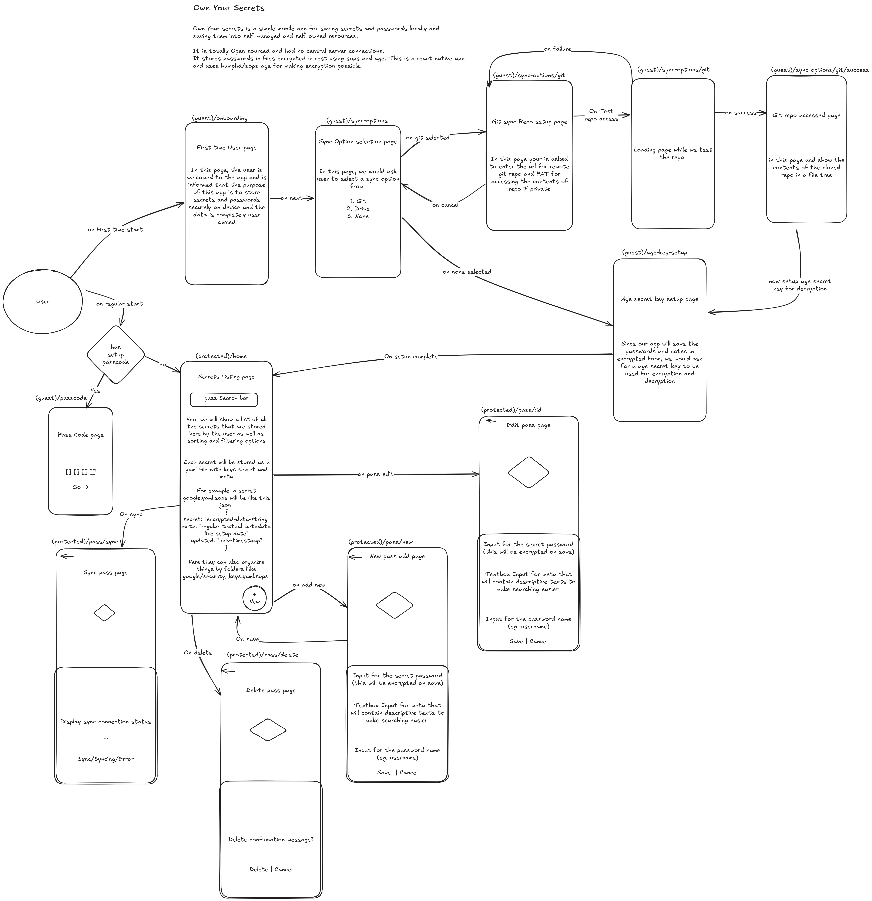

# Project: Own Your Secrets Mobile App

## Overview

"Own Your Secrets" is a secure, self-managed mobile application designed for saving and managing sensitive secrets like passwords and notes. Unlike traditional password managers, it emphasizes user control by storing data locally and allowing synchronization with self-owned resources (like Git repositories) rather than relying on central servers. The app prioritizes privacy and security through encryption.

## Core Principles

- **Self-Owned Data:** All secrets are stored locally on the user's device.
- **Encryption at Rest:** Secrets are encrypted using `sops` and `age` protocols before being saved to files.
- **No Central Servers:** The app operates without connecting to any external, third-party servers for data storage or synchronization.
- **Open Source:** The project is intended to be fully open-source.
- **Self-Managed Sync:** Synchronization relies on protocols like Git, where the user controls the remote endpoint.

## Technology Stack

- **Mobile Framework:** React Native
- **Monorepo Structure:** The project is structured as a monorepo containing multiple `packages` (shared components, logic, utilities) and `apps` (the main mobile application). The mobile app will reside in `apps/ownyoursecrets`.
- **Encryption:** `sops` and `age` via the `humphd/sops-age` library/integration for React Native. This will involve interacting with native code to perform encryption/decryption operations.
- **Navigation:** React Navigation (specifically, stack navigators).
- **UI:** Standard React Native components, potentially leveraging reusable components from a `packages/ui` library within the monorepo (assume basic React Native components if a specific UI package isn't defined yet).
- **Storage:** React Native filesystem APIs for storing encrypted files locally.
- **Sync (Initial):** Git integration for pushing/pulling encrypted files. This will involve Git command execution (likely through a React Native bridge).
- **pnpm:** For package management and dependency management.
- **Turborepo:** For managing the monorepo structure, optimizing builds, and running tasks across packages and apps.

## Project Structure (within the monorepo)

```

/
|- apps/
| |- ownyoursecrets/  <- The main React Native app
|     |- app/
|     |  |- (guest|protected)/  <- Screens for guest and protected flows
|     `- package.json
|- packages/
| |- ui/ <- shared UI components + RNR components + Tailwind components
|- package.json <- Monorepo root package.json
|- turbo.json <- Turborepo configuration

```

The primary focus for the LLM agent will be generating code within `apps/ownyoursecrets/app/`.

## User Flow and Screens

The provided diagram (referenced externally) is the authoritative source for the user flow and the required screens. Key screens and flows include:

1.  **Initial App Start:** Decision point: Has the user completed setup (passcode, age key)?
2.  **Guest Flow (First Time Setup):**
    - Onboarding Page
    - Sync Option Selection Page (Git, Drive, None)
    - Git Sync Setup Flow:
      - Git Sync Repo Setup Page (Input URL, PAT)
      - Loading Page (Testing Repo Access)
      - Git Repo Accessed Page (Show file tree)
    - Age Secret Key Setup Page (Generate/Import Age Key)
    - Transition to Protected Home
3.  **Authentication Flow (Regular Start):**
    - Pass Code Page (Input Passcode)
    - Transition to Protected Home on success
4.  **Protected Flow (Authenticated User):**
    - Secrets Listing Page (Home Screen with search, list of secrets)
    - New Pass Add Page (Input secret data)
    - Edit Pass Page (Edit existing secret data)
    - Delete Pass Flow (Delete Confirmation Page)
    - Sync Pass Page (Manual Sync Trigger and Status)

## Key Functionality Notes

- **Encryption/Decryption:** The `encrypt(data, ageKey)` and `decrypt(encryptedData, ageKey)` functions are implemented and tested in `lib/crypto.ts`. The LLM should focus on _when_ these functions are called.
- **File Storage:** Secrets will be stored as encrypted JSON files (`.json`) in a vault directory within the app's document directory, utilizing `expo-file-system`. Secret names can include slashes to create subdirectories (e.g., `google/2fa` will be stored in `vault/google/2fa.json`). Secret metadata is stored as a plain text string.
- **Git Sync:** The LLM should create the UI for Git setup and the component for the manual sync page. It should integrate placeholder calls for Git operations (`clone`, `pull`, `push`).
- **Vault Management (`lib/vault.ts`):**
  - `saveSecret(secretName, secretData, metadata, ageSecretKey)`: Encrypts and saves a new secret to the vault. Handles creation of subdirectories based on `secretName`.
  - `getSecret(secretName, ageSecretKey)`: Retrieves and decrypts a specific secret from the vault.
  - `listSecrets()`: Recursively lists all secrets in the vault, providing their metadata and file paths.
  - `editSecret(secretName, newSecretData, newMetadata, ageSecretKey)`: Updates an existing secret's data and metadata in place.
  - `deleteSecret(secretName)`: Removes a secret file from the vault.
  - `importVault(importedData, ageSecretKey)`: Imports multiple secrets from a JSON backup file into the vault.
  - `exportVault(ageSecretKey)`: Exports all secrets from the vault into a single JSON object.
- **Fuzzy Search:** The `SecretsListingPage` now utilizes `fuse.js` for fuzzy searching, prioritizing secret names and metadata for improved search results.
- **Empty State Message:** The `SecretsListingPage` now displays an informative message when no secrets are found, guiding users to add new secrets or import existing ones.
- **Passcode:** A simple PIN/passcode for quick access. This is _not_ used for file encryption (Age handles that), but for app-level access control. It should be stored securely (e.g., using `react-native-keychain` or encrypted preferences).

## Development Guidelines and Preferences

- **Navigation:** Use `expo-router` for file-based routing instead of `react-navigation`.
- **Styling:** Prefer Tailwind CSS for all styling. Utilize the colors and typography defined in `apps/ownyoursecrets/global.css`.
- **UI Components:** Use `react-native-reusables` (the shadcn/ui equivalent for React Native) for UI components. New components should be added to `packages/ui`.
- **CLI Commands:** When using `react-native-reusables` CLI commands (e.g., `npx @react-native-reusables/cli@latest add <component>`), ensure they are run from the specific app or package directory (e.g., `apps/ownyoursecrets`) and not the monorepo root.

## App Architecture



> NOTE: Compress the chat at the end of the conversation to save token count. Also append highly relevant information to the GEMINI.md file that could be useful for the future llm agents.
