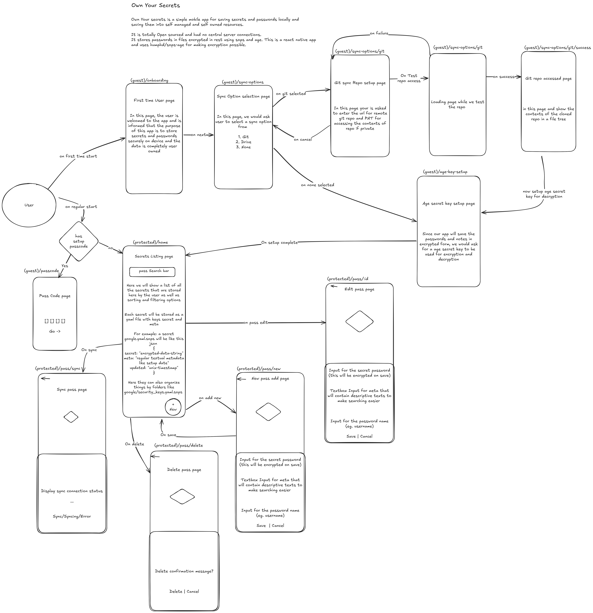

# Own Your Secrets

"Own Your Secrets" is a secure, self-managed mobile application designed for saving and managing sensitive secrets like passwords and notes. Unlike traditional password managers, it emphasizes user control by storing data locally and allowing synchronization with self-owned resources (like Git repositories) rather than relying on central servers.

## Core Principles

- **Self-Owned Data:** All secrets are stored locally on the user's device.
- **Encryption at Rest:** Secrets are encrypted using `sops` and `age` protocols before being saved to files.
- **No Central Servers:** The app operates without connecting to any external, third-party servers for data storage or synchronization.
- **Open Source:** The project is fully open-source.
- **Self-Managed Sync:** Synchronization relies on protocols like Git, where the user controls the remote endpoint.

## Features

- **Secure Storage:** Uses `age` encryption for robust security.
- **Git Sync:** Sync your encrypted secrets across devices using your own Git repository.
- **Offline First:** Works completely offline.
- **Biometric Unlock:** Secure access with device biometrics.
- **Fuzzy Search:** Quickly find your secrets using `fuse.js`.
- **File-based Vault:** Secrets are stored as individual encrypted files, making them easy to manage and backup.

## Tech Stack

- **Framework:** React Native (Expo)
- **Monorepo:** Turborepo
- **Encryption:** `sops`, `age` (via `humphd/sops-age`)
- **Styling:** Tailwind CSS (NativeWind)
- **Navigation:** Expo Router
- **Package Manager:** pnpm

## Archtecture




## Getting Started

### Prerequisites

- Node.js
- pnpm
- Expo Go (for testing on device) or Android/iOS Simulator

### Installation

1. Clone the repository:
   ```bash
   git clone <repository-url>
   cd ownyoursecrets
   ```

2. Install dependencies:
   ```bash
   pnpm install
   ```

3. Run the app:
   ```bash
   # Navigate to the app directory
   cd apps/ownyoursecrets

   # Start the development server
   pnpm start
   ```

## Project Structure

This project is a monorepo managed by Turborepo.

- `apps/ownyoursecrets`: The main React Native mobile application.
- `packages/ui`: Shared UI components.
- `packages/expo-isomorphic-fs`: Isomorphic file system utilities.
- `packages/typescript-config`: Shared TypeScript configurations.

## Contributing

Contributions are welcome! Please feel free to submit a Pull Request.

